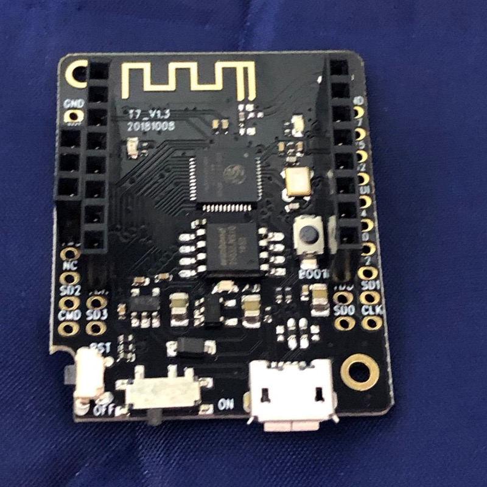

# IoTBNE Garden Spike

This is a project created for the learn-about-circuit-manufacture
workshop, first held in May 2019 for the Brisbane Internet of Things
Interest Group (IoTBNE).

Design and coding is
by [Christopher Biggs](http://christopher.biggs.id.au) and Tim Hadwen
of [Accelerando Consulting](https://accelerando.com.au).  Christopher
is the convenor of IoTBNE.

# About the Project

This project is a computer that lives in your garden, powered by the
sun (it also has a battery which charges during the day, and powers
the computer during the night).

The garden computer is connected to:

* A soil moisture sensor
* A rain/sprinkler sensor
* A temperature sensor
* A humidty sensor
* Your home WiFi
* A server on the internet that shows the measurements on your phone

All these pieces work together to give you a dashboard, right on your
iPhone or Android, of the health of your garden, right now and over
the last few weeks.

We are also going to use this project as an example, to illustrate the
journey from Problem to Product in the Internet of Things.

**What's "The Internet of Things"?**  It's the collection of all the
computers in the world which look after Things, not People.  Our
laptop and desktop computers are for us, their main job is to show
information to our human eyes, I call this The Internet of People.   
Unlike the Internet of People, computers in the Internet of Things are
out of our sight, they talk to each other, and to servers on the
internet, but they don't often talk directly to us.  Our "Internet of
People" computers might talk to the same servers to learn about what
the IoT devices have recorded, or even send them commands.   You could
argue that intelligent systems like Alexa, Siri, Google, Cortana and
friends are bilingual, they are part IoP and part IoT.


# Getting started with the software

We are going to use a programming environment called "Arduino", named
after a pub in Italy where three art teachers met to create a computer
that was intended to allow artists and non-technical creative people
to create art with computers.   The inexpensive Arduino platform was
revolutionary because it allowed people young and old to use sensors
and robotics to widen their world.

## Install the Arduino Integrated Development Environment (IDE)

Humans instruct computers do to things by writing lists of
instructions called **Computer Programs** (or "Software" because the
computer program is an intangible abstract creation, as distinct from
the "Hardware", being the electronics and components that you can
physically touch).  The **art of composing software programs** is called
**Programming**, also known as Coding.

An **Integrated Development Environtment** (IDE) is a program that you
install on your computer which lets you edit computer "**source
code**" (which is the (mostly) human readable part of coding) and then
turn it into "**machine code**" that the computers can understand (but
which is tricky for humans to understand).  This conversion process is
called "**compiling**".  (The I in IDE stands for "Integrated" because
the editor and the compiler used to be separate tools).

Your instructor will provide a USB memory stick with the Arduino IDE
on it.  You can also if you prefer download the Arduino IDE directly
from [the Arduino Download Page](https://www.arduino.cc/en/Main/Software).

## Install the ESP32 Compiler add-on for Arduino.

**Arduino** is both the name of the **software**, and a brand of
computer **hardware**.  The Arduino environment proved so popular that
many other computers (not made by the Arduino company) have also been
enabled to run the Arduino software.

The first Arduino computers used a kind of computer chip called the
"Atmel AVR".  We will be using a different computer which uses a chip
called the "Espressif ESP32".  The ESP32 understands a different
dialect of machine code from that understood by the Atmel AVR, so we
will need to download some extra software to allow the Arduino IDE to
compile our source code into the kind of machine code that the ESP32
understands.

Please follow
[these instructions](https://accelerando.com.au/learn/system-on-chip/esp32/)
to install the ESP32 add-on for Arduino.

## Install the USB drivers for our ESP32 Development board

We will copy our machine code onto the ESP32's internal memory using a
USB cable.  The board will show up as a "COM Port" (aka Serial port)
on your computer when connected.  If it does not show up you will need
to install the drivers for the "CH340" USB device,
using
[these instructions](https://accelerando.com.au/learn/microcontrollers/interfacing/)

# Getting started with the hardware

Now that we have all the software we need, let's make the hardware do
our bidding.

We will begin with the "Brain" of our project, a "Development Board"
called the "TTGO Mini 32".  This board has an ESP32 processor, some
memory, a USB port, a battery charger, and some sockets for attaching
sensors.



In broad terms, a computer consists of a **Central Processing Unit
(CPU)** which processes information, and **peripheral devices** which
provide information about the real world, or turn information into
real-world actions.  The ESP32 microprocessor has a number of built in
peripheral devices.  It has a WiFI radio, a bluetooth radio, some
other communication interfaces and a number of General Purpose Input
Output Pins (GPIOs).   **Digital** IO pins represent the informational
concepts of True and False (or 1 and 0) as a high voltage and a low
voltage respectively.  

A digital GPIO pin can be programmed to **output** either High Voltage (3.3v)
or Low Voltage (0v).  We use this voltage to control outside devices.
A GPIO pin can also be programmed to *sense* voltage, or act as an
**input**, a high voltage will be read as a 1 and a low voltage will
be read as a 0.

In addition to **digital** GPIO pins, the ESP32 also has some
**analog** GPIO pins.  Unlike digital pins which can represent only
the numbers 0 and 1, analog IO pins instead represent (or sense) a
number as a proportional voltage, eg an analog input may treat 0v as
the number 0, 3.3v as the number 4095, and any voltage in between as
the proportionate number in between 0 and 4095.

## Step one: make it blink

We are going to make the built-in Light Emitting Diode (LED) flash on
the board.  This is perhaps the simplest thing you can make a
microprocessor do, and it's traditionally the first program we run on
a new device, just to confirm that everything works.

Let's begin by opening the Arduino IDE.

Now select from the menu bar `File -> Examples -> 01.Basics -> Blink`.
A new window will open containing the **source code** of one of the
Arduino example programs.   This one just makes a light blink.


Many development boards have a built in Light Emitting Diode (LED) for
testing.  Your **TTGO Mini 32** development board has three

	* A red power LED that is always on
	* A blue LED that lights up when the battery is charging
	* A green LED that is connected to the ESP32's "General Purpose
      Input/Output number 22", or GPIO22.   
	  
We are going to modify this blink program to use GPIO22, by adding one
more line after line 24.

```
#define LED_BUILTIN 22
```

Lines 20-30 should thus look like

```
 This example code is in the public domain.

  http://www.arduino.cc/en/Tutorial/Blink
*/

#define LED_BUILTIN 22
// the setup function runs once when you press reset or power the board
void setup() {
  // initialize digital pin LED_BUILTIN as an output.
  pinMode(LED_BUILTIN, OUTPUT);
}

```


What does all this mean?
[You can learn more here](https://accelerando.com.au/learn/microcontrollers/programming/).

Note, when reading the above article, that the original Arduino (with
Atmel AVR microprocessor) has its LED on GPIO13, while our ESP32 uses
GPIO22.

### Compile your first program

Now we have a program, we are going to **Compile** it, that is
translate the **source code** which we wrote (and can read), into
**machine code** which has the same meaning as the source code we
wrote, but is in a form that the computer can understand, and process
the instructions we wrote.

First, we have to tell the Arduino IDE which computer chip we are
using.  Select the `Tools` menu and then `Board`.  You will get a
cascading menu with a lot of names in it.   Look for a section named
"ESP32 Arduino" and select the first option below it "ESP32 Dev
Module".

Select the `Tools` menu again, then `Port`.  Select the Serial Port
that represents the USB interface on your board.   Compare the serial
port list before and after plugging in the board if you are not sure
which one.   You are looking for the new entry that appears after you
connect your board.

Click the 'Compile' button (the tick icon, at the left hand side of
the toolbar).  If your program is valid (makes sense to the compiler),
you will get a successful compilation resulting some machine code.
If your source code is not valid, you will get some error messages,
and welcome to the boundless world of correcting (or "de-bugging")
your program.    Seriously, call for a facilitator to help you if you
are stuck.

Once we have a successful compilation we can copy the machine code to
the memory chip on the board, this is referred to as "Uploading".
Click the Upload button (second icon from the left, a
rightward-pointing arrow).

Watch the status message at the bottom of the source code window.  It
will say "Uploading" and later change to "Upload complete" or "Upload
failed".

If the upload succeeds, watch for the green LED on your board to begin
flashing!   You have compiled and uploaded your first program.

## Step two: install the Spike program

### Download the spike program from GitHub

Now lets install the program that makes our module perform the task we
want, to act as a garden soil sensor.

If you are reading these instructions on Github, look at the top right
of the page for a green button marked "clone or download".   Click it,
then click "Download ZIP".    After the download completes, extract
the downloaded Zipfile. 

Open up the Arduino IDE and choose `File -> Open`.   Look for the
folder you extracted (named spike) and open `spike.ino`.

**Please note**:

* Make sure you download the whole project (as a ZIP file or via `git clone`, **not just** the `spike.ino` file).
* You must rename the folder containing spike.ino and other files to be named `spike` (not, say `spike-master`).

### Install third-party source-code libraries

Spike makes use of some **library source code** written by other authors.
Libraries provide ways to do common tasks without having to build
everything from scratch yourself.  The Arduino system includes a large
number of optional libraries that you can install to control many
kinds of hardware.

In the Arduino IDE select the menu `Sketch -> Include Library -> Manage
Libraries`.   Search for and install the following libraries:

* Blynk
* DHT sensor library for ESPx
* ArduinoJSON (**select version 6.6.0-beta before clicking install**)

The following library is not in the library manager list, and must be
downloaded separately.   On Windows unzip it to Documents/Arduino/libraries.
Location on Mac or Linux may vary, place it where you find the other
libraries (eg search for Blynk after installing it).

* https://github.com/unixbigot/WIFIMANAGER-ESP32/archive/HTTPHEAD.zip

### Run the program (Upload it to your Mini32)

Click the `Upload` button in the Arduino IDE (second from left in the
toolbar, with the rightward-arrow icon).

After the upload completes, click the "serial monitor" button , at the
far right of the toolbar (magnifying-glass icon, or select the menu
`Tools -> Serial Monitor`).

A window should open showing messages from the ESP32.  You should see some messages that look like:

```
IoTBNE Garden Spike, v1 May 2019
#      33 NOTICE void _printWakeReason()(238) ESP Wakeup reason: other
#      33 NOTICE void setup()(186) IO Setup
```

(and many more).

## Step three: get your Spike on the WiFi

Your spike doesn't know the name of your WiFI network, nor your WiFi
password yet.  We could use the USB cable to send it this information
password, or embed it in the source code, but you wouldn't want to
have to go dig up your garden if you change your wifi password.

So our program for the ESP32 will, if it cannot successfully join any
WiFi network, create its own network named "esp_[number]".   When you
join this network from your laptop or phone, it will display a web
page where you can configure which wifi to join, and supply the password.
You can also change some other settings on this page.

This "captive portal" page uses the same mechanism that you may have
encountered in internet cafes or hotel wifi.

Connect your ESP32 to your computer, and open the Arduino Serial
Monitor.

Press the reset switch on your board (look for a tiny button marked
`RST`), and you should see some messages.  Look for a mesage about
having connected to the WiFi and received an IP address.

If the board cannot connect to WiFi it will go back to the access
point mode, and you can connect it to change the settings.   The
message window will contain the name of the hotspot that the device
has created.

If you want to force the board to go into setup mode, unplug any
peripheral shields and connect a jumper lead between GPIO5 and GND,
then reset the board.  It should go into access point mode (you can
then remove the jumper lead).

## Step four: plug in the peripherals

A popular wifi-enabled arduino-compatible development board is named
the "Lolin D1 Mini".  It has 16 pins in two rows and is designed to
connect to "shields" which stack on top of the development board.

Our TTGO Mini32 development board is more powerful than the D1 and has
many more pins, but it is designed to be compatible with the D1's
shields.  The top portion of the inner rows of pins on the TTGO
matches the function of the D1s pins, so that we can plug in D1
shields.

The garden spike project uses a particular Digital Humidity and
Temperature sensor (a module called the DHT11) fitted to a D1 shield.
Next we'll attach this sensor.

### Temperature/Humidity sensor

Your spike does only one job: it powers on, connects to wifi, reads
information from some sensors, transmits the information to a server
on the internet, and then goes to sleep for one minute.   After a
minute it will reboot and repeat the process.   Forever.

But, there are no peripherals attached yet, so the input values won't mean
anything.  Let's attach our first sensor.


Our temperature and humidity sensor peripheral comes on a **shield**
that plugs into the sockets on the dev board.  Make sure you orient it
the correct way around (look for the pins marked RST at the top of the
shield and align it with the socket market RST on the TTGO development
board.

Plug your spike back in, and open up the Arduino serial monitor.  When
the board prints "SENSORS" you should see the temperature and humidity
values start to make sense.

### Let's make a dashboard with "Blynk"

We are now going to use a free phone app called "**Blynk**" to view the sensor
values.   Our board will transmit the readings to Blynk's servers, and
our app will fetch them from the same server.

Begin by searching your phone's app store for the Blynk application.
Create an account which will allow you to host your own dashboards.

#### Import the app

**You must create an account on Blynk and log into Blynk on your phone
first**

Now tap the "Scan QR" code icon in the blynk toolbar and scan this
code.   This will create a copy of the Spike Application.


Blynk allows simple apps to be created for free.  For more complex
apps extra widgets may be purchased via in-app purchase.   You can
scan the code below to obtain a more complex app, but you may have to
spend a couple of dollars to unlock extra widgets.


#### Configure your device to connect to your application

In Blynk, tap the hexagonal "settings" icon, and look for a section
marked "auth token".  Tap 'email' to email the token to yourself.

Now we need to type that token into your Dev Board's settings.
Connect GPIO5 to GND and reboot your board.   Join your board's WiFi
network and, when the settings page is shown, enter the auth token
value into the corresponding box on the settings page.

Have a look at the other settings; you should give your device a
unique name, for example, this will be used when we later upload
programs to your device "Over The Air" (via wifi instead of using a
USB cable).

Back on your phone, click the "Play" icon to start the app.   Now
reboot your development board.   Within a minute you should see the
temperature and humidity value appear on your phone.

We have made our first IoT dashboard app.

### Connect more sensors

We have two more sensors to connect, a rain sensor and a soil moisture
sensor. 


## Oh wait, we ran out of sockets!

But where do we connect them?    The DHT shield is blocking the sockets.

The D1 shield system is designed to allow shields to stack on top of
each other, using special components that have a pin below the board and a
socket above it.   But our DHT shield has only pins, no sockets.
This is because we want it to be the "top" of the stack.   We must fit
our other devices underneath it.

But there is no "soil sensor shield" available to buy for the D1
system, nor a "rain sensor shield".  So we made one.  We call it
"Frankenshield".  It isn't pretty.


In fact, we made the shield deliberately ugly to prove a point.   When
you are at the proof of concept stage, you want rapid validation, so
you do the simplest thing that could possibly work, no matter how
ugly.    Beauty will come later.

The Frankenshield is made using "Veroboard" which has a grid of holes 
with copper tracks running the length of the board.   This allows us
to create "one off" circuit boards by cutting and joining the tracks
as needed.   Before creating printed circuit boards became cheap,
quick and easy, various kinds of "prototyping boards" were commonly
used for, well, prototypes.

Later in this workshop we will design a Printed Circuit Board (PCB) to
replace the Frankenshield.

### Connecting the FrankenShield

The "Frankenshield" connects at the bottom of the D1 socket, using
many of the same pins as the DHT sheild.  It also uses some of the
pins in the outer row.   These are special Analog input pins, which
allow us to sense the voltage output from the sensors.

The Arduino environment has a built in procedure called `analogRead`
which returns a number representing the voltage present on an analog input
pin.  A voltage of 0v corresponds to the number zero, and a voltage of
3.3v corresponds to the number 4095 (4095 is the largest number that can be
represented with 12 **binary digits**, or **bits** for short, thus we say
the ESP32's analog input has a "12-bit precision"). 

### The rain sensor

The rain sensor connects to the two pins on the left hand side of the
Frankenshield.  **It does not matter which way around the sensor is
connected.**

**Warning: Science Content**: the following paragraph discusses
**electrical resistance**.  If you are new to electronics, you can
learn more about the basic concepts we will
discuss [here](https://accelerando.com.au/learn/basics/).   You can
safely skip the next paragraph if you do not want to know the details.

The rain sensor printed circuit board consists of two copper tracks
which are closely spaced but not connected.   We connect one track to
3.3v and the other to the analog input pin.   We also connect the
analog input pin to 0v via a **resistor**.   The resistor makes the
voltage at the input pin "want" to be zero volts, but the particular resistor has
we use has very high resistance, so we refer to this as a "weak
pull-down resistor".   When something bridges the tracks on the rain
sensor board, this constitutes a lower resistance than the pull-down,
so voltage on the input pin is "pulled up" to somewhere between zero
and 3.3 volts.   This results in an `analogRead()` call for the input
pin returning a number between 0 and 4095.    When the rain sensor is
perfectly dry and clean, we expect it to read as 0; when rain falls,
the value read will be higher. 

To read the rain sensor we call `analogRead()`, which returns a number
between 0 and 4095 representing the input voltage, then we **scale** the
number, so instead of being between 0 and 4095 it is between 0
and 100.   You can think of this reading as "X percent rainy".

### The soil-moisture sensor

It is possible to sense soil moisture in the same way, using a spiked probe
with copper tracks and measuring the soil resistance, but the presence
of voltage in the complex soil environment causes chemical reactions
which can corrode the probe.

**Warning: Science Content**.   You can safely skip the 
next paragraph if you do not want to know the details.

Instead we use a more complex **Capacitive** sensor, which is
insulated from the soil by a layer of paint.   The dampness of the
soil effects its **conductivity**, if we apply an electric charge to
the insulated probe, the charge can "leak" away via the
electromagnetic field created in the slightly conductive soil.
Measuring the rate at which charge leaks away allows us to infer the
dampness of the soil without actually touching it.

Like the soil sensor, to read the rain sensor we call `analogRead()`,
which returns a number between 0 and 4095 representing the input
voltage.  However the soil sensor will return 4095 in perfectly dry
soil, and a lower number in damp soil.  We subtract the result from
4095 to "invert it", then we scale the number again, so instead of
being between 4095 (dry) and 0(wet) it is between 0 (dry) and 100
(wet).  You can thus think of this reading as "X percent damp".

The soil sensor is an **active sensor**, which means we must give it
power to operate the electronic circuit built into the probe.   The
probe has 3 wires: 

  * Red - Power (3.3volts)
  * Black - Ground (0 volts)
  * Yellow - output voltage (this will
carry a voltage that varies between 0v and 3.3v depending on soil
moisture level).   

We use a 4-pin connector with one pin removed, which makes it
assymetrical; while not strictly necessary, this is a convenient way
to prevent connecting the sensor "backwards".

On the frankenshield there are three pins at the right with one
separated.

The two pins at left are for Power (L) and Ground (R).   The single
pin on the right is for the yellow wire.

You will need to remove the three sockets wires from the black
housing, by lifting up the little black spring tabs on the housing and
then gently tugging on the wire.   Your kit includes a four-pin
housing into which you can insert the three sockets, leaving a gap to
match the gap in the pins.   


### The hidden third sensor - battery voltage

Many battery powered development boards connect the battery to one of
the analog pins to allow the CPU to measure the battery voltage,
giving the system the capability to send an alert (or shut down) when
the battery is going flat.    Unfortunately, our TTGO Mini32 does not
have this arrangement.   So the Frankenshield also provides this.
Fortunately, the 5v socket on the TTGO is also connected to the battery,
so the frankenshield can access the battery voltage through the shield pins.

**Warning: Science Content**.   You can safely skip the 
next paragraph if you do not want to know the details.

The analog input pins on the ESP32 can read a voltage between 0 and
3.3 volts.  Connecting a voltage higher than 3.3 volts can damage the
pins.  But our battery is a **Lithium Ion** battery which measures 4.2 volts
when full (and around 2.9 volts when "flat").   To safely measure the
battery voltage, we **divide** it using a **voltage divider**.   We
take two resistors of equal resistance.   We connect one to the
positive terminal of the battery (4.2v) and the other to the negative
(0v).  We join the other ends of the two resistors together.   We
choose a fairly high resistance so that only a small current flows, so
as not to waste the battery.   If we measure the voltage at the
junction of the two resistors, it will be half of the battery
voltage.   If we connect that junction to an analog input pin, a
reading of 0 will mean 0 volts, and a reading of 4095 (a measured
voltage of 3.3v) would mean that the battery voltage was 6.6v.

To read the battery voltage, we call analogRead() on the pin 
which is connected to the battery via a voltage-divider, giving half
of the battery voltage.   We multiply the analog reading by `6.6/4095`, giving
us a a number equal to the battery voltage.

Your battery plugs into a small beige socket on the underside of the
TTGO board.


### Putting it all together

Let's assemble our contraption.  Plug the frankenshield into the TTGO
development board, being careful to align the pins.  Now plug the DHT
shield into the frankenshield.  Connect the battery to your TTGO
board, and turn on the power switch.

You should see the red power light turn on.   After a few seconds the
green LED should blink, this indicates that the Arduino `loop()` procedure has
been run.   Our loop procedure does five things:

1. Flash the green LED
2. Read the analog input pins connected to Frankenshield
3. Read the temperature and humidity from the DHT sheield
4. Transmit the values to the Blynk servers on the internet
5. Set a wake-up timer, and go into "deep sleep" mode

When the timer goes off, the board will "wake up" and repeat the
above steps, for as long as the battery lasts.

When the ESP32 goes into "deep sleep" it turns off the WiFi and other
high-power-use components, and uses only a trickle of current.
Without the deep sleep, the ESP will consume approximately 0.1 Amperes
of current (100mA), and the battery would run flat in just a few
hours.  By using deep sleep to reduce our power needs, we can extend
our battery life without recharging to a week or more.  By charging
the battery each day via our solar panel, we can realise almost
indefinite battery life.

# Oh yuck, how do we replace that Franken-Shield?

When it was popularised after World War Two, the Printed Circuit Board
revolutionsed electronics, taking it from a world of hand-assembled
Franken-Shields to an assembly line of (now) robot-assembled identical
devices.

If you're at the the IoTBNE workshop, then you are sitting in the
facility of our hosts, Masters and Young, one of Brisbane's most
advanced circuit design and assembly businesses.

Some businesses make just circuit boards, some just do assembly, some
do both.  There are manufacturing services to suit every budget, from
the hobbyist with just $5 to spend, to advanced scientific and
military applications with exacting requirements quality and
robustness.

For the experimenter and hobbyist the process of moving from "jumble
of wires" to "professional product" looks like this

1. Sketch out a **schematic diagram** of the electronic circuit you want to make
2. Use a **schematic capture** program on your computer to create a
   digital representation of your circuit, its connections and the
   components that comprise it.
3. Use a **circuit board layout** program to turn your schematic into
   a diagram of the multiple layers of tracks, holes, cuts and protective/informational
   paint layers that will comprise your Printed Circuit Board.
4. Send your board layout to a PCB Manufacturing Service
5. Either assemble the components onto the returned board yourself, or
   pay extra to have the manufacturing service do this.

## Install the necessary software

There are many **Electronic Design Automation** (EDA) software
products available, costing anywhere from zero to tens of thousands of
dollars.   We are going to choose one of the "zero" options today.

We will be using the **KiCad** suite, which is popular in hobbyist and
enthusiast circles, though it lacks some features that some would
consider essential.

Begin by downloading the installation files from
the [KiCad download page](http://www.kicad-pcb.org/download/).
Your instructor will also have a USB memory stick with the files
already downloaded.

The KiCad suite consists of a number of separate programs, including

1. The KiCad project manager (the "main tool" that launches the
   others)
2. A schematic-capture program named **eeschema**
3. A PCB layout program named **pcbnew** (I'm sorry, engineers have
   less than sparkling taste when naming things).
4. A file-viewer that understands displays the "Gerber" files needed
   by the manufacturing robots, named **gerbview** (are you seeing a
   pattern?).

## Install some component libraries

The process of creating (or "capturing") your schematic diagram
is essentially three steps

1. Drag and drop the components from a **component library** onto your
   page
2. Arrange the components in a way that makes logical sense to you
3. Draw "wires" between the components

The layout of the components on your schematic diagram need not bear
any resemblance to how you will place them on the PCB.  Sometimes it
makes sense to arrange them similarly to how they will sit in the real
world, sometimes not.

The KiCad suite comes with a large component library that contains
"symbols" and "footprints" for many common components.   But it does
not contain the "footprint" (the exact physical dimensions of the
copper pads that will hold the component) for a D1 Shield socket.

KiCad contains tools to create your own symbols and footprints, and as
you journey into the world of circuits you will accumulate your own
library of components that you have created to suit your needs.

However, the Internet is a wonderful place, and Open Source is magic, 
so somebody else has already created the component we will need and
made it freely available.   We are going to use the component designed
by [Raoul Rubien, here](https://github.com/rubienr/wemos-d1-mini-kicad).

This design has already been downloaded and added to this project, but
in general, when faced with a component for which you do not have a
symbol, search the internet first before undertaking to create your
own symbol.

# Let's design an Electronic Circuit

The Spike repository contains some example projects. 

1. A blank project containing just the pins for a "D1 Shield"
2. A project contaning all the parts of the Frankenshield
3. An example of a completed "FrankenShield 2.0"

Open up the first of these, the "`shield-blank`" project.

You should see the project manager page, which lists the documents
that are part of the `shield-blank` project.


Click on the icon for the schematic file, `shield-blank.sch`.


# Let's design a Printed Circuit Board (PCB)

# Let's get our PCB made


